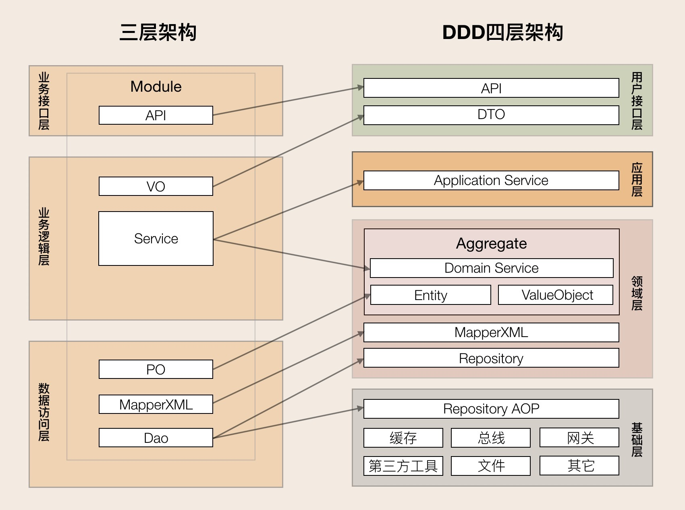
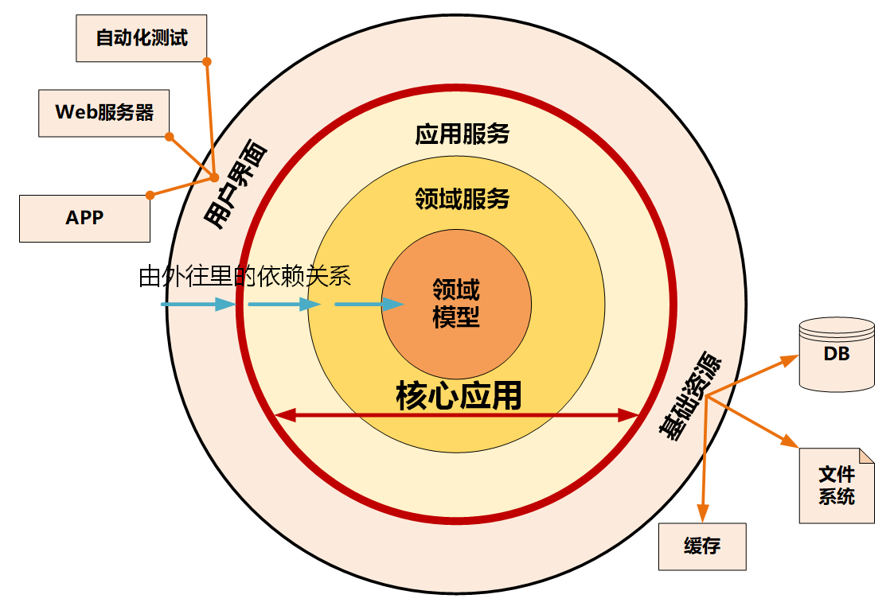

# DDD名词解释

- **领域**：领域就是用来确定范围的，范围即边界，DDD 的领域就是这个边界内要解决的业务问题域。

- **子域**：领域可以进一步划分为子领域。我们把划分出来的多个子领域称为子域，每个子域对应一个更小的问题域或更小的业务范围。子域跟根据自身重要性和功能属性划分为三大子域，分别是：核心域、通用域和支撑域。

- **核心域**：决定产品和公司核心竞争力的子域是核心域，它是业务成功的主要因素和公司的核心竞争力。

- **通用域**：没有太多个性化的诉求，同时被多个子域使用的通用功能子域是通用域。比如认证、权限等等，这类应用很容易买到，没有企业特点限制，不需要做太多的定制化。

- **支撑域**：既不包含决定产品和公司核心竞争力的功能，也不包含通用功能的子域。例如数据代码类的数据字典等系统。

- **限界上下文**：可以将限界上下文拆解为两个词：限界和上下文。限界就是领域的边界，而上下文则是语义环境。同样的一个东西，由于业务领域的不同，赋予了这些术语不同的涵义和职责边界，这个边界就可能会成为未来微服务设计的边界。

- **实体**

  > **它们拥有唯一标识符，且标识符在历经各种状态变更后仍能保持一致。对这些对象而言，重要的不是其属性，而是其延续性和标识，对象的延续性和标识会跨越甚至超出软件的生命周期。**
  >
  > 1. 实体的业务形态
       >
       >    领域模型中的实体是多个属性、操作或行为的载体。我们可以根据命令、操作或者事件，找出产生这些行为的业务实体对象，进而按照一定的业务规则将依存度高和业务关联紧密的多个实体对象和值对象进行聚类，形成聚合。实体和值对象是组成领域模型的基础单元。
  >
  > 2. 实体的代码形态
       >
       >    在代码模型中，实体的表现形式是实体类，这个类包含了实体的属性和方法，通过这些方法实现实体自身的业务逻辑。在 DDD 里，这些实体类通常采用充血模型，与这个实体相关的所有业务逻辑都在实体类的方法中实现，跨多个实体的领域逻辑则在领域服务中实现。
  >
  > 3. 实体的运行形态
       >
       >    实体以 DO（领域对象）的形式存在，每个实体对象都有唯一的 ID。我们可以对一个实体对象进行多次修改，修改后的数据和原来的数据可能会大不相同。但是，由于它们拥有相同的 ID，它们依然是同一个实体。
  >
  > 4. 实体的数据库形态
       >
       >    与传统数据模型设计优先不同，DDD 是先构建领域模型，针对实际业务场景构建实体对象和行为，再将实体对象映射到数据持久化对象。
       >
       >    在领域模型映射到数据模型时，一个实体可能对应 0 个、1 个或者多个数据库持久化对象。大多数情况下实体与持久化对象是一对一。在某些场景中，有些实体只是暂驻静态内存的一个运行态实体，它不需要持久化。比如，基于多个价格配置数据计算后生成的折扣实体。
       >
       >    而在有些复杂场景下，实体与持久化对象则可能是一对多或者多对一的关系。比如，用户 user 与角色 role 两个持久化对象可生成权限实体，一个实体对应两个持久化对象，这是一对多的场景。再比如，有些场景为了避免数据库的联表查询，提升系统性能，会将客户信息 customer 和账户信息 account 两类数据保存到同一张数据库表中，客户和账户两个实体可根据需要从一个持久化对象中生成，这就是多对一的场景。
  >
  > **实体的特点：**有 ID 标识，通过 ID 判断相等性，ID 在聚合内唯一即可。状态可变，它依附于聚合根，其生命周期由聚合根管理。实体一般会持久化，但与数据库持久化对象不一定是一对一的关系。实体可以引用聚合内的聚合根、实体和值对象。

- **值对象**

  > 通过对象属性值来识别的对象，它将多个相关属性组合为一个概念整体。在 DDD 中用来描述领域的特定方面，并且是一个没有标识符的对象。值对象描述了领域中的一件东西，这个东西是不可变的，它将不同的相关属性组合成了一个概念整体。**当度量和描述改变时，可以用另外一个值对象予以替换。它可以和其它值对象进行相等性比较，且不会对协作对象造成副作用。值对象本质上就是一个集。**
  >
  > 1. 值对象的业务形态
       >
       >    值对象是若干个属性的集合，只有数据初始化操作和有限的不涉及修改数据的行为，基本不包含业务逻辑。值对象的属性集虽然在物理上独立出来了，但在逻辑上它仍然是实体属性的一部分，用于描述实体的特征。
  >
  > 2. 值对象的代码形态
       >
       >    如果值对象是单一属性，则直接定义为实体类的属性；如果值对象是属性集合，则把它设计为 Class 类，Class 将具有整体概念的多个属性归集到属性集合，这样的值对象没有 ID，会被实体整体引用。
  >
  > 3. 值对象的运行形态
       >
       >    实体实例化后的 DO 对象的业务属性和业务行为非常丰富，但值对象实例化的对象则相对简单和乏味。除了值对象数据初始化和整体替换的行为外，其它业务行为就很少了。
       >
       >    值对象嵌入到实体的话，有这样两种不同的数据格式，也可以说是两种方式，分别是==属性嵌入==的方式和==序列化大对象==的方式。
       >
       >    引用单一属性的值对象或只有一条记录的多属性值对象的实体，可以采用属性嵌入的方式嵌入。引用一条或多条记录的多属性值对象的实体，可以采用序列化大对象的方式嵌入。比如，人员实体可以有多个通讯地址，多个地址序列化后可以嵌入人员的地址属性。==值对象创建后就不允许修改了，只能用另外一个值对象来整体替换。==
  >
  > 4. 值对象的数据库形态
       >
       >    DDD 引入值对象是希望实现从“数据建模为中心”向“领域建模为中心”转变，减少数据库表的数量和表与表之间复杂的依赖关系，尽可能地简化数据库设计，提升数据库性能。
       >
       >    在领域建模时，我们可以将部分对象设计为值对象，保留对象的业务涵义，同时又减少了实体的数量；在数据建模时，我们可以将值对象嵌入实体，减少实体表的数量，简化数据库设计。
  >
  > 5. 值对象的优势和局限
       >
       >    值对象采用序列化大对象的方法简化了数据库设计，减少了实体表的数量，可以简单、清晰地表达业务概念。这种设计方式虽然降低了数据库设计的复杂度，但却无法满足基于值对象的快速查询，会导致搜索值对象属性值变得异常困难。
       >
       >    值对象采用属性嵌入的方法提升了数据库的性能，但如果实体引用的值对象过多，则会导致实体堆积一堆缺乏概念完整性的属性，这样值对象就会失去业务涵义，操作起来也不方便。
  >
  > **值对象的特点：**无 ID，不可变，无生命周期，用完即扔。值对象之间通过属性值判断相等性。它的核心本质是值，是一组概念完整的属性组成的集合，用于描述实体的状态和特征。值对象尽量只引用值对象。

- **聚合**

  > **领域模型内的实体和值对象就好比个体，而能让实体和值对象协同工作的组织就是聚合，它用来确保这些领域对象在实现共同的业务逻辑时，能保证数据的一致性。**聚合就是由业务和逻辑紧密关联的实体和值对象组合而成的，**聚合是数据修改和持久化的基本单元**，每一个聚合对应一个仓储，实现数据的持久化。
  >
  > **聚合在 DDD 分层架构里属于领域层**，领域层包含了多个聚合，共同实现核心业务逻辑。聚合内实体以充血模型实现个体业务能力，以及业务逻辑的高内聚。跨多个实体的业务逻辑通过领域服务来实现，跨多个聚合的业务逻辑通过应用服务来实现。比如有的业务场景需要同一个聚合的 A 和 B 两个实体来共同完成，我们就可以将这段业务逻辑用领域服务来实现；而有的业务逻辑需要聚合 C 和聚合 D 中的两个服务共同完成，这时你就可以用应用服务来组合这两个服务。
  >
  > **聚合的特点：**
  >
  > 高内聚、低耦合，它是领域模型中最底层的边界，可以作为拆分微服务的最小单位，但我不建议你对微服务过度拆分。但在对性能有极致要求的场景中，聚合可以独立作为一个微服务，以满足版本的高频发布和极致的弹性伸缩能力。
  >
  > 一个微服务可以包含多个聚合，聚合之间的边界是微服务内天然的逻辑边界。有了这个逻辑边界，在微服务架构演进时就可以以聚合为单位进行拆分和组合了，微服务的架构演进也就不再是一件难事了。

- **聚合根**

  > 聚合根的主要目的是为了避免由于复杂数据模型缺少统一的业务规则控制，而导致聚合、实体之间数据不一致性的问题。
  >
  > 传统数据模型中的每一个实体都是对等的，如果任由实体进行无控制地调用和数据修改，很可能会导致实体之间数据逻辑的不一致。而如果采用锁的方式则会增加软件的复杂度，也会降低系统的性能。
  >
  > 如果把聚合比作组织，那聚合根就是这个组织的负责人。**==聚合根也称为根实体，它不仅是实体，还是聚合的管理者。==**
  >
  > 首先它作为实体本身，拥有实体的属性和业务行为，实现自身的业务逻辑。其次它作为聚合的管理者，在聚合内部负责协调实体和值对象按照固定的业务规则协同完成共同的业务逻辑。最后在聚合之间，它还是聚合对外的接口人，以聚合根 ID 关联的方式接受外部任务和请求，在上下文内实现聚合之间的业务协同。也就是说，聚合之间通过聚合根 ID 关联引用，如果需要访问其它聚合的实体，就要先访问聚合根，再导航到聚合内部实体，外部对象不能直接访问聚合内实体。
  >
  > **聚合根的特点：**
  >
  > 聚合根是实体，有实体的特点，具有全局唯一标识，有独立的生命周期。一个聚合只有一个聚合根，聚合根在聚合内对实体和值对象采用直接对象引用的方式进行组织和协调，聚合根与聚合根之间通过 ID 关联的方式实现聚合之间的协同。

  **构建聚合：**

    1. 采用事件风暴，根据业务行为，梳理出在发生这些行为的所有的实体和值对象。
    2. 从众多实体中选出适合作为对象管理者的根实体，也就是聚合根。判断一个实体是否是聚合根，你可以结合以下场景分析：是否有独立的生命周期？是否有全局唯一 ID？是否可以创建或修改其它对象？是否有专门的模块来管这个实体。
    3. 根据业务单一职责和高内聚原则，找出与聚合根关联的所有紧密依赖的实体和值对象。构建出 1 个包含聚合根（唯一）、多个实体和值对象的对象集合，这个集合就是聚合。在图中我们构建了客户和投保这两个聚合。
    4. 在聚合内根据聚合根、实体和值对象的依赖关系，画出对象的引用和依赖模型。
    5. 多个聚合根据业务语义和上下文一起划分到同一个限界上下文内。

  **聚合的一些设计原则：**

    1. **在一致性边界内建模真正的不变条件。**聚合用来封装真正的不变性，而不是简单地将对象组合在一起。聚合内有一套不变的业务规则，各实体和值对象按照统一的业务规则运行，实现对象数据的一致性，边界之外的任何东西都与该聚合无关，这就是聚合能实现业务高内聚的原因。
    2. **设计小聚合。**如果聚合设计得过大，聚合会因为包含过多的实体，导致实体之间的管理过于复杂，高频操作时会出现并发冲突或者数据库锁，最终导致系统可用性变差。而小聚合设计则可以降低由于业务过大导致聚合重构的可能性，让领域模型更能适应业务的变化。
    3. **通过唯一标识引用其它聚合。**聚合之间是通过关联外部聚合根 ID 的方式引用，而不是直接对象引用的方式。外部聚合的对象放在聚合边界内管理，容易导致聚合的边界不清晰，也会增加聚合之间的耦合度。
    4. **在边界之外使用最终一致性。**聚合内数据强一致性，而聚合之间数据最终一致性。在一次事务中，最多只能更改一个聚合的状态。如果一次业务操作涉及多个聚合状态的更改，应采用领域事件的方式异步修改相关的聚合，实现聚合之间的解耦（相关内容我会在领域事件部分详解）。
    5. **通过应用层实现跨聚合的服务调用。**为实现微服务内聚合之间的解耦，以及未来以聚合为单位的微服务组合和拆分，应避免跨聚合的领域服务调用和跨聚合的数据库表关联。

# DDD 分层架构

1. **用户接口层**

   > 用户接口层负责向用户显示信息和解释用户指令。这里的用户可能是：用户、程序、自动化测试和批处理脚本等等。

2. **应用层**

   > 应用层是很薄的一层，理论上不应该有业务规则或逻辑，主要面向用例和流程相关的操作。但应用层又位于领域层之上，因为领域层包含多个聚合，所以它可以协调多个聚合的服务和领域对象完成服务编排和组合，协作完成业务操作。
   >
   > 此外，应用层也是微服务之间交互的通道，它可以调用其它微服务的应用服务，完成微服务之间的服务组合和编排。
   >
   > 在设计和开发时，不要将本该放在领域层的业务逻辑放到应用层中实现。因为庞大的应用层会使领域模型失焦，时间一长你的微服务就会演化为传统的三层架构，业务逻辑会变得混乱。
   >
   > 应用服务是在应用层的，它负责服务的组合、编排和转发，负责处理业务用例的执行顺序以及结果的拼装，以粗粒度的服务通过 API 网关向前端发布。还有，应用服务还可以进行安全认证、权限校验、事务控制、发送或订阅领域事件等。

3. **领域层**

   > 领域层的作用是实现企业核心业务逻辑，通过各种校验手段保证业务的正确性。领域层主要体现领域模型的业务能力，它用来表达业务概念、业务状态和业务规则。
   >
   > 领域层包含聚合根、实体、值对象、领域服务等领域模型中的领域对象。
   >
   > 领域模型的业务逻辑主要是由实体和领域服务来实现的，其中实体会采用充血模型来实现所有与之相关的业务功能。实体和领域服务在实现业务逻辑上不是同级的，当领域中的某些功能，单一实体（或者值对象）不能实现时，领域服务就会出马，它可以组合聚合内的多个实体（或者值对象），实现复杂的业务逻辑。

4. **基础层**

   > 基础层是贯穿所有层的，它的作用就是为其它各层提供通用的技术和基础服务，包括第三方工具、驱动、消息中间件、网关、文件、缓存以及数据库等。比较常见的功能还是提供数据库持久化。
   >
   > 基础层包含基础服务，它采用依赖倒置设计，封装基础资源服务，实现应用层、领域层与基础层的解耦，降低外部资源变化对应用的影响。
   >
   > 比如说，在传统架构设计中，由于上层应用对数据库的强耦合，很多公司在架构演进中最担忧的可能就是换数据库了，因为一旦更换数据库，就可能需要重写大部分的代码，这对应用来说是致命的。那采用依赖倒置的设计以后，应用层就可以通过解耦来保持独立的核心业务逻辑。当数据库变更时，我们只需要更换数据库基础服务就可以了，这样就将资源变更对应用的影响降到了最低。

==**DDD 核心思想是通过领域驱动设计方法定义领域模型，从而确定业务和应用边界，保证业务模型与代码模型的一致性。**==

> DDD 是一种处理高度复杂领域的==设计思想==，它试图分离技术实现的复杂性，并围绕业务概念构建领域模型来控制业务的复杂性，以解决软件难以理解，难以演进的问题。==DDD 不是架构，而是一种架构设计方法论==，它通过边界划分将复杂业务领域简单化，帮我们设计出清晰的领域和应用边界，可以很容易地实现架构演进。

DDD 包括战略设计和战术设计两部分：

- 战略设计主要从业务视角出发，建立业务领域模型，划分领域边界，建立通用语言的限界上下文，限界上下文可以作为微服务设计的参考边界。
- 战术设计则从技术视角出发，侧重于领域模型的技术实现，完成软件开发和落地，包括：聚合根、实体、值对象、领域服务、应用服务和资源库等代码逻辑的设计和实现。

# 几种常见架构

## 整洁架构

> 
>
> 整洁架构又名“洋葱架构”。整洁架构的层就像洋葱片一样，它体现了分层的设计思想。
>
> 在整洁架构里，同心圆代表应用软件的不同部分，从里到外依次是领域模型、领域服务、应用服务和最外围的容易变化的内容，比如用户界面和基础设施。
>
> 整洁架构最主要的原则是依赖原则，它定义了各层的依赖关系，越往里依赖越低，代码级别越高，越是核心能力。外圆代码依赖只能指向内圆，内圆不需要知道外圆的任何情况。
>
> **在洋葱架构中，各层的职能是这样划分的：**
>
> - 领域模型实现领域内核心业务逻辑，它封装了企业级的业务规则。领域模型的主体是实体，一个实体可以是一个带方法的对象，也可以是一个数据结构和方法集合。
> - 领域服务实现涉及多个实体的复杂业务逻辑。
> - 应用服务实现与用户操作相关的服务组合与编排，它包含了应用特有的业务流程规则，封装和实现了系统所有用例。
> - 最外层主要提供适配的能力，适配能力分为主动适配和被动适配。主动适配主要实现外部用户、网页、批处理和自动化测试等对内层业务逻辑访问适配。被动适配主要是实现核心业务逻辑对基础资源访问的适配，比如数据库、缓存、文件系统和消息中间件等。
> - 红圈内的领域模型、领域服务和应用服务一起组成软件核心业务能力。

## 六边形架构

> 
>
> 六边形架构又名“端口适配器架构”。追溯微服务架构的渊源，一般都会涉及到六边形架构。
>
> 六边形架构的核心理念是：应用是通过端口与外部进行交互的。
>
> 在六边形架构中，红圈内的核心业务逻辑（应用程序和领域模型）与外部资源（包括 APP、Web 应用以及数据库资源等）完全隔离，仅通过适配器进行交互。它解决了业务逻辑与用户界面的代码交错问题，很好地实现了前后端分离。六边形架构各层的依赖关系与整洁架构一样，都是由外向内依赖。
>
> **六边形架构将系统分为内六边形和外六边形两层，这两层的职能划分如下：**
>
> - 红圈内的六边形实现应用的核心业务逻辑。
> - 外六边形完成外部应用、驱动和基础资源等的交互和访问，对前端应用以 API 主动适配的方式提供服务，对基础资源以依赖倒置被动适配的方式实现资源访问。
>
> 六边形架构的一个端口可能对应多个外部系统，不同的外部系统也可能会使用不同的适配器，由适配器负责协议转换。这就使得应用程序能够以一致的方式被用户、程序、自动化测试和批处理脚本使用。

## 三种微服务架构模型的对比和分析

> 
>
> 三种架构都考虑了前端需求的变与领域模型的不变。需求变幻无穷，但变化总是有矩可循的，用户体验、操作习惯、市场环境以及管理流程的变化，往往会导致界面逻辑和流程的多变。但总体来说，不管前端如何变化，在企业没有大的变革的情况下，核心领域逻辑基本不会大变，所以领域模型相对稳定，而用例和流程则会随着外部应用需求而随时调整。
>
> 架构模型通过分层的方式来控制需求变化从外到里对系统的影响，从外向里受需求影响逐步减小。面向用户的前端可以快速响应外部需求进行调整和发布，灵活多变，应用层通过服务组合和编排来实现业务流程的快速适配上线，减少传导到领域层的需求，使领域层保持长期稳定。

