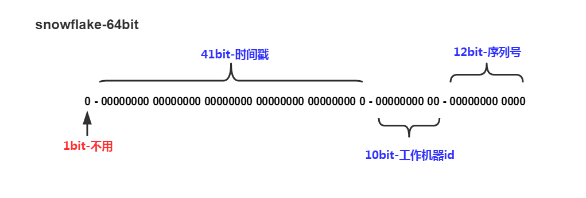

# 分布式ID需要满足的条件

- 全局唯一：必须保证ID是全局性唯一的，基本要求。当前公司需要业务唯一ID，所以在不同业务线可以存在相同ID。
- 高性能：高可用低延时，ID生成响应要块，否则反倒会成为业务瓶颈
- 高可用：100%的可用性是骗人的，但是也要无限接近于100%的可用性
- 好接入：要秉着拿来即用的设计原则，在系统设计和实现上要尽可能的简单
- 趋势递增：最好趋势递增，看具体业务场景，一般不严格要求

# 常见的分布式ID生成方式

## UUID

> UUID是一个128比特的数值，这个数值可以通过一定的算法计算出来。为了提高效率，常用的UUID可缩短至16位。
>
> UUID由以下几部分的组合：
>
> 1. 当前日期和时间，UUID的第一个部分与时间有关，如果你在生成一个UUID之后，过几秒又生成一个UUID，则第一个部分不同，其余相同
> 2. 时钟序列
> 3. 全局唯一的IEEE机器识别号，如果有网卡，从网卡MAC地址获得，没有网卡以其他方式获得。 UUID的唯一缺陷在于生成的结果串会比较长
>
> 优点：
>
> - 生成足够简单，本地生成无网络消耗，具有唯一性
>
> 缺点：
>
> - uuid过长，往往用字符串表示，作为主键建立索引查询效率低
> - 无法保证趋势递增

## 基于数据库自增ID

> ### 单机模式
>
> ### 集群模式
>
> > 设置起始值和自增步长，当扩容时，需要重新设置起始值和步长
>
> ### 号段模式
>
> > 每次从数据库取出一个号段范围，例如 (1,1000] 代表1000个ID，具体的业务服务将本号段，生成1~1000的自增ID并加载到内存。
> >
> > 申请号段时可能存在并发问题，可以加一个乐观锁。

## 基于Redis实现

> ==注意==
>
> 当Redis持久化使用的是RDB，Redis重启时，自增ID可能来不及持久化，可能存在重复ID的问题。

## Twitter Snowflake算法

> 
>
> `Snowflake`生成的是long类型的ID，long类型占8个Byte，64个bit
>
> - 时间戳
    >
    >   41bit可以使用2^40/1000/60/60/24/365=69.73年
>
> - 工作id
    >
    >   可以用于1024台机器
>
> - 序列号
    >
    >   一毫秒内可以生成2^12=4096个ID

## 美团 Leaf

> There are no two identical leaves in the world.		——德国哲学家、数学家莱布尼茨
>
> Leaf中有两种获取分布式ID的方式，一种是Leaf-segement，另一种是Leaf-snowflake。
>
> ### Leaf-segement
>
> Leaf-segement是从数据库中获取指定业务的一个号段。
>
> - biz_tag用来区分业务
> - max_id表示该biz_tag目前所被分配的ID号段的最大值
> - step表示每次分配的号段长度
>
> 原来获取ID每次都需要写数据库，现在只需要把step设置得足够大，比如1000。那么只有当1000个号被消耗完了之后才会去重新读写一次数据库。
>
> ```sql
> +-------------+--------------+------+-----+-------------------+-----------------------------+
> | Field       | Type         | Null | Key | Default           | Extra                       |
> +-------------+--------------+------+-----+-------------------+-----------------------------+
> | biz_tag     | varchar(128) | NO   | PRI |                   |                             |
> | max_id      | bigint(20)   | NO   |     | 1                 |                             |
> | step        | int(11)      | NO   |     | NULL              |                             |
> | desc        | varchar(256) | YES  |     | NULL              |                             |
> | update_time | timestamp    | NO   |     | CURRENT_TIMESTAMP | on update CURRENT_TIMESTAMP |
> +-------------+--------------+------+-----+-------------------+-----------------------------+
> ```
>
> Leaf-segement中使用了双buffer，当号段消费到某个点时就异步的把下一个号段加载到内存中，消除在获取ID时可能发生的阻塞。
>
> - 每个biz-tag都有消费速度监控，通常推荐segment长度设置为服务高峰期发号QPS的600倍（10分钟），这样即使DB宕机，Leaf仍能持续发号10-20分钟不受影响。
> - 每次请求来临时都会判断下个号段的状态，从而更新此号段，所以偶尔的网络抖动不会影响下个号段的更新。
>
> ### Leaf-snowflake
>
> Leaf-segment方案可以生成趋势递增的ID，通过订单ID号相减就能大致计算出公司一天的某一业务的量。所以还可以选择Leaf-segement方案，Leaf-snowflake方案完全沿用snowflake方案的bit位设计。
>
> - 时间戳
    >
    >   在获取分布式ID时会校验当前戳，如果发生了机器时钟回拨的问题，产生的时间差小于等于5ms时，会等待两倍时间差，再获取ID。当时间差大于5ms时，则会直接报错。
    >
    >   ```java
>   public synchronized Result get(String key) {
>       long timestamp = timeGen();
>       if (timestamp < lastTimestamp) {
>           long offset = lastTimestamp - timestamp;
>           if (offset <= 5) {
>               try {
>                   wait(offset << 1);
>                   timestamp = timeGen();
>                   if (timestamp < lastTimestamp) {
>                       return new Result(-1, Status.EXCEPTION);
>                   }
>               } catch (InterruptedException e) {
>                   LOGGER.error("wait interrupted");
>                   return new Result(-2, Status.EXCEPTION);
>               }
>           } else {
>               return new Result(-3, Status.EXCEPTION);
>           }
>       }
>       if (lastTimestamp == timestamp) {
>           sequence = (sequence + 1) & sequenceMask;
>           if (sequence == 0) {
>               // seq 为0的时候表示是下一毫秒时间开始对seq做随机
>               sequence = RANDOM.nextInt(100);
>               timestamp = tilNextMillis(lastTimestamp);
>           }
>       } else {
>           // 如果是新的ms开始
>           sequence = RANDOM.nextInt(100);
>       }
>       lastTimestamp = timestamp;
>       long id = ((timestamp - twepoch) << timestampLeftShift) | (workerId << workerIdShift) | sequence;
>       return new Result(id, Status.SUCCESS);
>   }
>   ```
>
> - workerId
    >
    >   使用Zookeeper持久顺序节点自动分配workerId。在leaf_forever父节点下检查自己是否已经注册过，如果已经注册过，则获取原本workerId；如果没有注册过，则新建一个。
>
> - 序列号
    >
    >   序列号随机从0~100中开始。

# 百度 Uid-generator

> https://github.com/baidu/uid-generator
>
> 获取`ID`则有两种方式，`DefaultUidGenerator`类中获取的是实时的ID，`CachedUidGenerator`类是从内存中获取已经生成的ID。
>
> ## DefaultUidGenerator
>
> `DefaultUidGenerator`的产生id的方法与基本上就是常见的snowflake算法实现，仅有一些不同，如以秒为为单位而不是毫秒。
>
> 
>
> > - `UidGenerator`的时间戳是基于秒级别。但是`UidGenerator`通过借用未来时间来生成`ID`。28bit，最多可以借用未来`8.512年`。（此处官方文档写的8.7年？？？）
      > >
      > >   ```java
> >   private long getCurrentSecond() {
> >       long currentSecond = TimeUnit.MILLISECONDS.toSeconds(System.currentTimeMillis());
> >       if (currentSecond - epochSeconds > bitsAllocator.getMaxDeltaSeconds()) {
> >           throw new UidGenerateException("Timestamp bits is exhausted. Refusing UID generate. Now: " + currentSecond);
> >       }
> >       return currentSecond;
> >   }
> >   ```
> >
> > - `UidGenerator`的机器ID是由数据库进行分配的，机器启动一次，将机器信息添加至数据库，返回的主键即为机器ID。
      > >
      > >   ```java 
> >   public long assignWorkerId() {
> >       // 构建worker节点实体
> >       WorkerNodeEntity workerNodeEntity = buildWorkerNode();
> >       // 为新添加工作节点
> >       workerNodeDAO.addWorkerNode(workerNodeEntity);
> >       return workerNodeEntity.getId();
> >   }
> >   ```
> >
> > - 序列号
      > >
      > >   ```java
> >   protected synchronized long nextId() {
> >       long currentSecond = getCurrentSecond();
> >       // 时钟回拨不生成ID
> >       if (currentSecond < lastSecond) {
> >           long refusedSeconds = lastSecond - currentSecond;
> >           throw new UidGenerateException("Clock moved backwards. Refusing for %d seconds", refusedSeconds);
> >       }
> >       // 在同一秒内，增加序列号
> >       if (currentSecond == lastSecond) {
> >           sequence = (sequence + 1) & bitsAllocator.getMaxSequence();
> >           // 序列号达到上限，时间移到下一秒
> >           if (sequence == 0) {
> >               currentSecond = getNextSecond(lastSecond);
> >           }
> >       } else {
> >           // 新的一秒，序列号从0开始
> >           sequence = 0L;
> >       }
> >       lastSecond = currentSecond;
> >       // 生成ID
> >       return bitsAllocator.allocate(currentSecond - epochSeconds, workerId, sequence);
> >   }
> >   ```
>
> ## CachedUidGenerator
>
> `CachedUidGenerator`将会缓存生成的id。id存储在`RingBuffer`环形数组中。`RingBuffer`容量，默认为sequence最大值2^N。可通过`boostPower`配置进行扩容。`Uid-RingBuffer`用于存储Uid、`Flag-RingBuffer`用于存储Uid状态(是否可填充、是否可消费)。
>
> - Tail指针
    >   表示Producer生产的最大序号(此序号从0开始，持续递增)。Tail不能超过Cursor，即生产者不能覆盖未消费的slot。当Tail已赶上curosr，此时可通过`rejectedPutBufferHandler`指定PutRejectPolicy
> - Cursor指针
    >   表示Consumer消费到的最小序号(序号序列与Producer序列相同)。Cursor不能超过Tail，即不能消费未生产的slot。当Cursor已赶上tail，此时可通过`rejectedTakeBufferHandler`指定TakeRejectPolicy
>
> Tail、Cursor指针、Flag-RingBuffer采用了CacheLine补齐，避免了由RingBuffer带来的硬件级==「伪共享」==问题。最终单机QPS可达600万。
>
> 
>
> **RingBuffer填充时机**
>
> > - 初始化预填充
      > >   RingBuffer初始化时，预先填充满整个RingBuffer。
> > - 即时填充
      > >   Take消费时，即时检查剩余可用slot量(`tail` - `cursor`)，如小于设定阈值，则补全空闲slots。阈值可通过`paddingFactor`来进行配置（默认50%）。
> > - 周期填充
      > >   通过Schedule线程，定时补全空闲slots。可通过`scheduleInterval`配置，以应用定时填充功能，并指定Schedule时间间隔。

# 百度Uid-generator二次开发

> Uid-generator是针对全局分发ID，目前需求是需要对每个业务进行隔离，可以允许相同ID出现在不同业务中。
>
> 获取的ID关键在于seconds、workerId和sequence。在二次开发中，对workerId和sequence进行业务隔离。
>
> ## workerId
>
> 为了做到相同ID允许出现在不同业务，即相同的workerId允许出现在不同业务。workerId是机器插入表中的主键ID，因为workerId允许相同，即主键ID允许相同，所以每一个业务需要有一张表。
>
> workerId从原来的long类型，改为Map集合，Map中key为namespace，value为对应的workerId。
>
> 在获取workerId时，首先去Map中检查是否存在key为namespace的entry，如果不存在，再去数据库中查找是否存在worker_node_{namespace}的表，如果存在，初始化workerId，反之报错。
>
> ## sequence
>
> 不同业务中的sequence也是允许相同的，所以在sequence的保存中，也要从原来的long类型改为Map，Map的key同样是namespace，value为sequence。
>
> ## CachedUidGenerator
>
> CachedUidGenerator中ID存储在RingBuffer中，即RingBuffer也需要对业务进行隔离。同理，每一个namespace需要对应一个RingBuffer。

