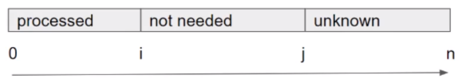
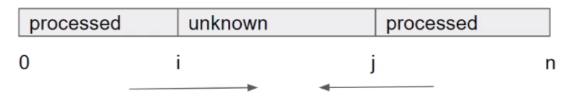

# 双指针

### **同向**



```java
int i = 0, j = 0;
while j < arr.length
```

### **反向**



```java
int i = 0, j = arr.length - 1;
while i <= j
```

# 二分查找

> Binary Search ==两大基本原则==
>
> 1. 每次都要缩减搜索区域
> 2. 每次缩减不能排除潜在答案

> 三大模板
>
> 1. 找一个准确值
> 	- 循环条件：left <= right
> 	- 缩减搜索空间：left = mid + 1, right = mid - 1
> 	- ==int mid = left + (right - left) / 2;==
> 2. 找一个模糊值
> 	- 循环条件：left < right
> 	- 缩减搜索空间：left = mid, right = mid - 1 或者 left = mid + 1, right = mid
> 	- ==int mid = left + (right - left + 1) / 2;==
> 3. 万用型
> 	- 循环条件：left < right - 1
> 	- 缩减搜索空间：left = mid, right = mid

# LinkedList

### 双指针

> - 找中间节点
>
> 	- 快慢指针
>
> - 找倒数第k个节点
>
> 	- 将两个指针隔开k个位置，相同速度前进
>
> - 逆转LinkedList
>
> 	```java
> 	public ListNode reverse(ListNode head) {
> 	    if (head == null || head.next == null) {
> 	        return head;
> 	    }
> 	    ListNode reversedHead = reverse(head.next);
> 	    head.next.next = head;
> 	    head.next = null;
> 	    return reversedHead;
> 	}
> 	```

### 递归

> linkedlist本身是不能从后往前访问的，但是可以借助递归来实现从后往前访问

# Stack

> Deque

### 单调栈

> 专门解决Next Greater Number
>
> 建议单调栈中存放的元素最好是下标而不是值

# Heap

> Heap的本质是一个用Array实现的Complete Binary Tree，这个Tree的root节点是这个Heap中最大(max heap)或者最小(min heap)的元素
>
> Online Algorithm(using heap)：针对一组流数据，没有固定长度
>
> Offline Algorithm(using sort)：针对一组固定长度数据
>
> - Max Heap
>
> - Min Heap
>
> 	PriorityQueue
>
> 	- peek()：查看栈顶元素 O(1)
> 	- poll()：拿出栈顶元素 O(logN)
> 	- offer()：添加元素 O(logN)

# Tree

### BFS(Breadth-First Search)

> BFS是按照“层”的概念进行的搜索算法，利用Queue记录需要被展开的TreeNode
>
> 模板
>
> 1. 初始化队列，并将所有的入口节点放入队列
> 2. while queue is not  empty
> 	1. 遍历当前队列中的每个节点
> 	2. 拿出元素，并根据题目要求添加到答案中
> 	3. 有序的添加下一层节点到queue中
> 	4. 下一层

### DFS

> ### Top Down DFS
>
> - 把值通过参数的形式从上往下传
> - 一般dfs()不返回值
>
> ### Bottom Up DFS
>
> - 把值从下往上传
> - 当前递归层利用subproblem传上来的值计算当前层的新值并返回
> - 一定会有返回值
>
> General Steps：
>
> 1. Base Case
> 2. 想子问题要答案（return value）
> 3. 利用子问题的答案构建当前问题（当前递归层）的答案
> 4. 若有必要，做一些额外的操作
> 5. 返回问题（给父问题）
>
> ```java
> // 树的前序遍历
> public void dfs(TreeNode node) {
> 	if (node == null) {
>         return;
>     }
>     System.out.println(node.val);
>     dfs(node.left);
>     dfs(node.right);
> }
> 
> // 树的中序遍历
> public void dfs(TreeNode node) {
> 	if (node == null) {
>         return;
>     }
>     dfs(node.left);
>     System.out.println(node.val);
>     dfs(node.right);
> }
> 
> // 树的后序遍历
> public void dfs(TreeNode node) {
> 	if (node == null) {
>         return;
>     }
>     dfs(node.left);
>     dfs(node.right);
>     System.out.println(node.val);
> }
> ```

# Graph

### BFS

> 以层为概念的搜索方式。因为是水平展开所有nodes，所以适合寻找最短路径。找最短路径只适合Uniform Cost(每条edge的weight一样)。
>
> 1. Initialize a Queue with all starting points, a HashSet to record visited nodes
> 2. While queue is not empty
> 	1. Retrieve current queue size as number of nodes in the current level
> 	2. for each node in current level
> 		1. Poll out one node
> 		2. If this is the node we want, return it
> 		3. Offer all its neighbor to the queue if not visited and valid
> 	3. Increase level

# 快速幂取余

# 蓄水池抽样

# 背包九讲

# 火车站选址

