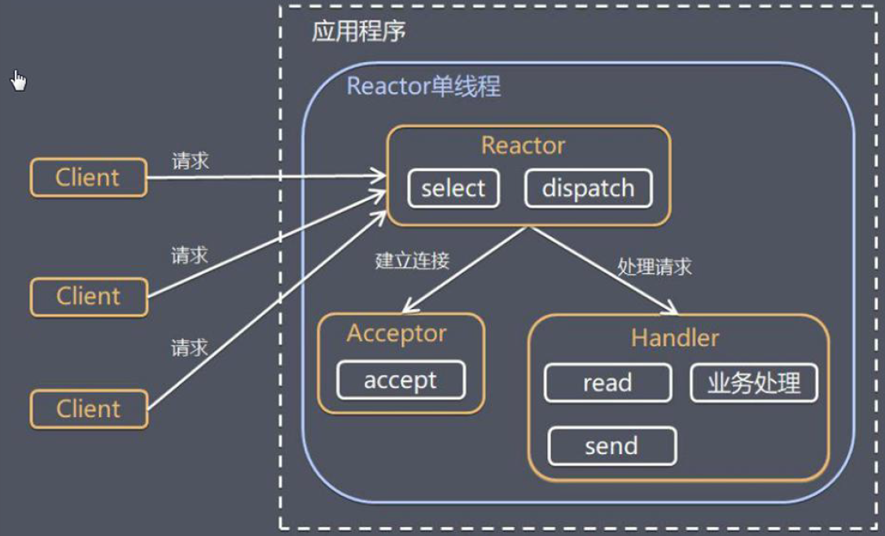
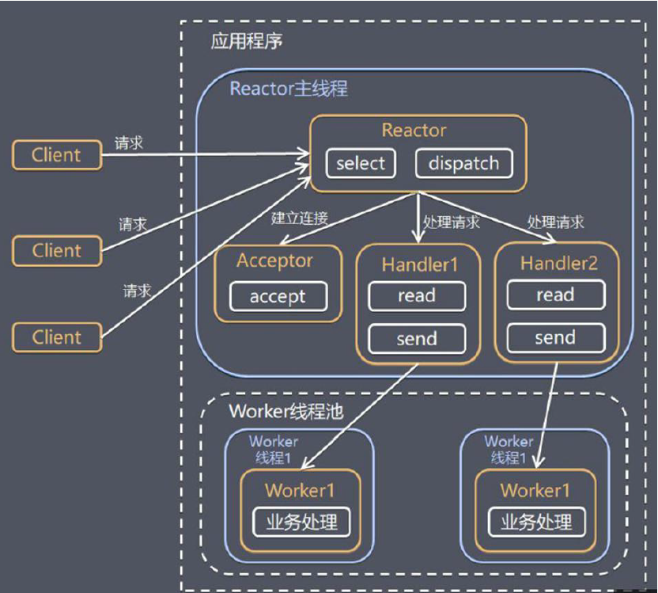
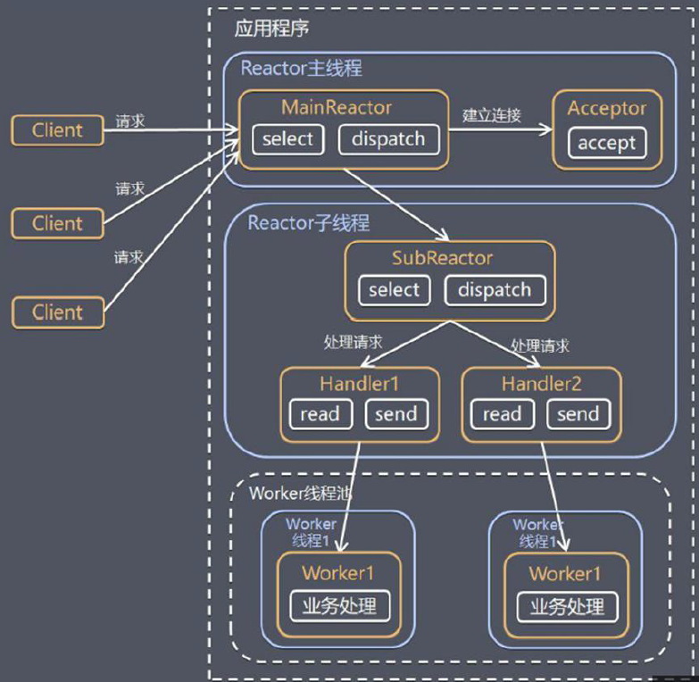

https://juejin.im/post/6844903703183360008

> Netty是一个**异步的、基于事件的**网络应用架构。

# Reactor线程模型

> - Reactor：在一个单独的线程中运行，负责监听和分发事件，分发给适当的处理程序来对IO事件做出反应。就像公司的电话接线员，它接听来自客户的电话并将线路转移到适当的联系人。
> - Handlers：处理程序执行I/O事件要完成的实际事件，类似于客户想要与之交谈的公司中的实际官员。Reactor通过调度适当的处理程序来响应I/O事件，处理程序执行非阻塞操作。

## 单Reactor单线程

> 1. `select`是I/O复用模型介绍的标准网络变成API，可以实现应用程序通过一个阻塞对象监听多路连接请求。
> 2. Reactor对象通过`select`监听客户端请求事件，收到事件后通过`dispatch`进行分发。
> 3. 如果是建立连接请求事件，则由Acceptor通过`accept`处理连接请求，然后创建一个Handler对象处理连接后的事件。
> 4. 如果不是连接请求，则Reactor会分发调用连接对应的Handler来进行处理。
> 5. Handler会完成`read`到`业务处理`到`send`的完整业务流程。
>
> - 优点：
> 	- 模型简单，没有多线程、进程通信、竞争的问题。
> - 缺点：
> 	- 性能问题：只有一个线程，无法完全发挥CPU的性能。Handler在处理某个业务时，整个进程无法处理其他连接事件。
> 	- 可靠性问题：线程意外终止或者进入死循环，会导致整个通信系统模块不可用，不能接受和处理外部消息。

## 单Reactor多线程

> 1. Reactor对象通过`select`监控客户端请求事件，收到事件后通过`dispatch`分发
> 2. 如果是建立连接请求，则由Acceptor通过`accept`处理连接请求，然后创建一个Handler对象处理完成连接后的各种事件。
> 3. 如果不是连接请求，则由Reactor分发调用连接对应的Handler来处理。
> 4. Handler只负责相应事件，不做具体的业务处理，通过`read`读取数据后，会发给后面的Worker线程池中的某个线程处理。
> 5. Worker线程池会分配独立线程完成任务，并将结果返回给Handler。
> 6. Handler收到响应后，通过`sennd`将结果返回给Client。
>
> - 优点：
> 	- 可以充分利用多核CPU的性能。
> - 缺点：
> 	- 多线程数据和共享比较复杂。
> 	- Reactor处理所有的监听和响应，高并发会出现性能瓶颈。

## 主从Reactor多线程

> 1. Reactor主线程MainReactor对象通过`select`监听连接事件，通过Acceptor处理连接事件。
> 2. 当Acceptor处理连接事件后，MainReactor将连接分配给SubReactor。
> 3. SubReactor将连接加入到连接队列进行监听，并创建Handler进行各种事件处理。
> 4. 当有新的事件发生时，SubReactor就会调用对应的Handler处理。
> 5. Handler通过`read`读取数据，分发给后面的Worker线程处理。
> 6. Worker线程池分配独立的Worker线程处理业务，并返回结果。
> 7. Handler收到响应的结果后，在通过`send`将结果返回给Client。
> 8. Reactor主线程可以对应多个Reactor子线程，即MainReactor可以关联多个SubReactor。
>
> - 优点：
> 	- 父线程和子线程的职责明确，父线程只负责接受新连接，子线程完成业务操作。
> 	- 父线程和子线程的数据交互简单，Reactor主线程只需要把新连接传给子线程，子线程无需再返回数据。
> - 缺点：
> 	- 编程复杂度高。

