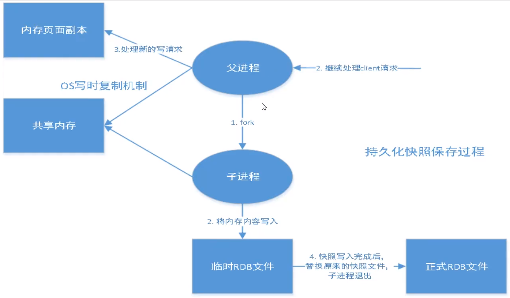
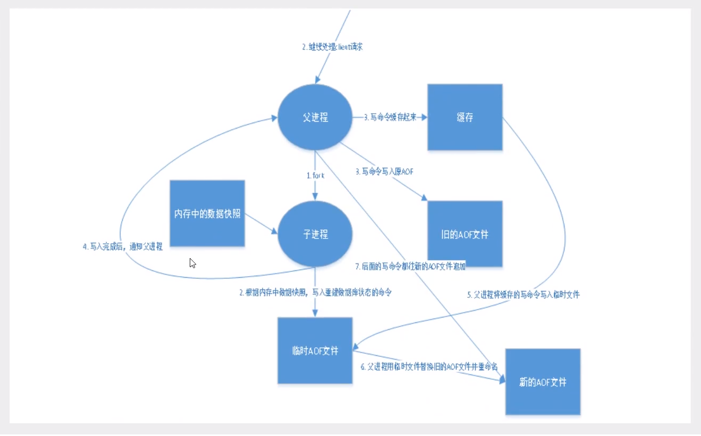
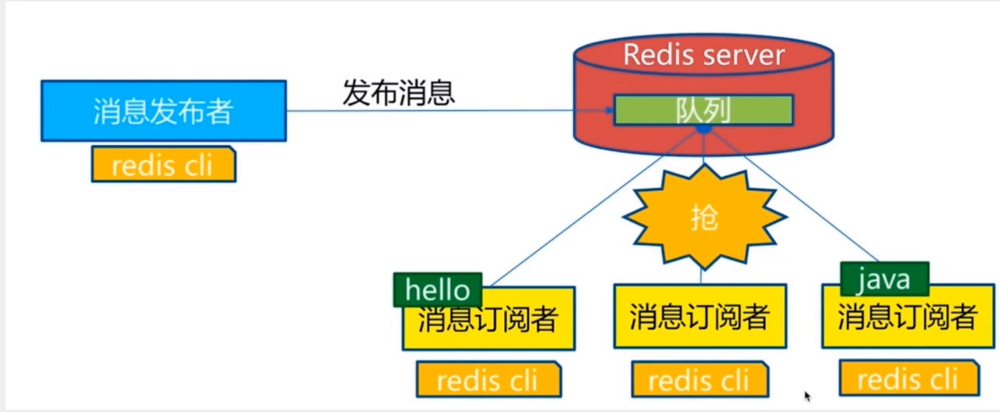
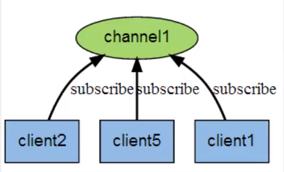
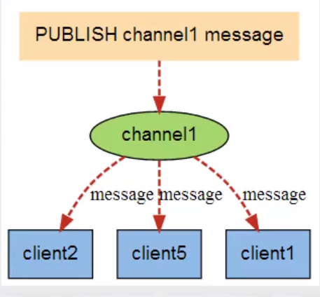
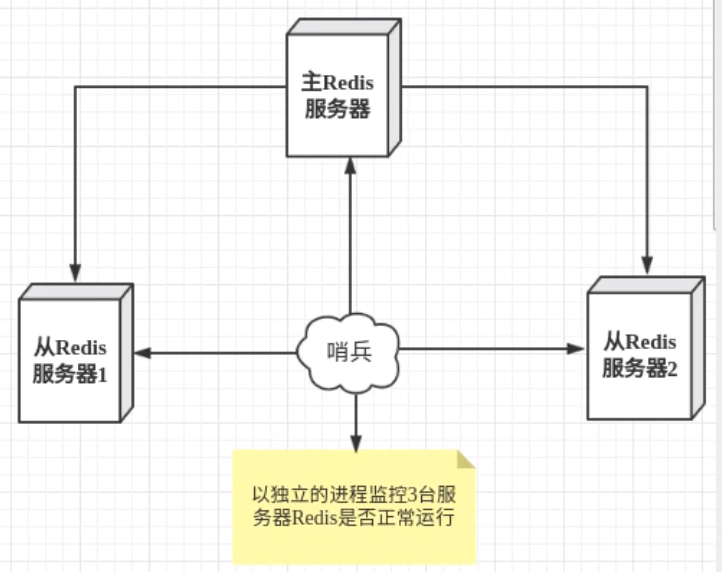
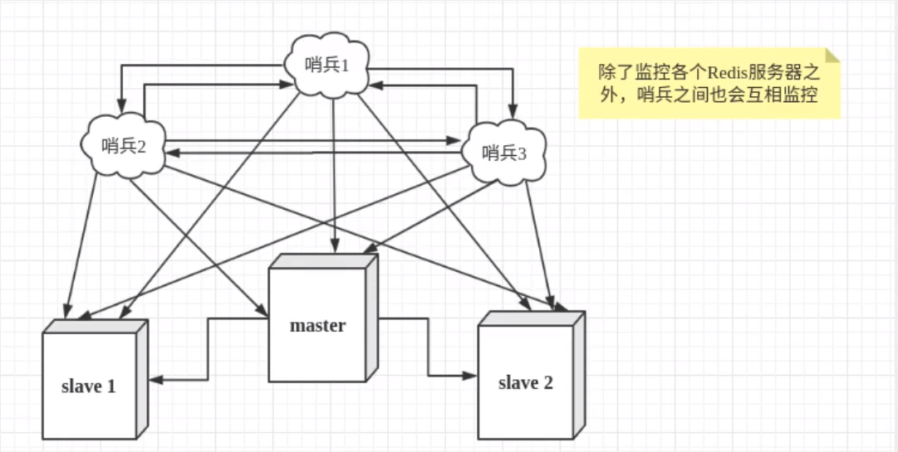

# Redis

[Redis内部存储结构](https://www.cnblogs.com/wujinsen/p/8949293.html)

[Redis面经](https://juejin.im/post/6844904017387077640)

# Redis是什么

Redis（Remote Dictionary Service，远程字典服务）是C语言开发的一个**开源**(遵从BSD协议)的**高性能键值对**(key-value)的**内存数据库**。可以用作数据库、缓存、消息中间件等。它是一种NoSQL(not-only sql)的数据库。

**Redis特点：**

- 性能优秀，数据存放在内存中，读写速度非常快，根据官方文档信息，读的速度是**110K**次/s,写的速度是**81K**次/s。
- **在处理业务时是单进程单线程，是线程安全的（因为如果是多线程会引起CPU的上下文切换，非常耗时）；在处理其他业务时，采用IO多路复用机制**。
- 丰富的数据类型，支持字符串(strings)、散列(hashes)、列表(lists)、集合(sets)、有序集合(sorted sets)等。
- 支持数据持久化，RDB、AOF、RDB与AOF同时使用。
- 主从复制，哨兵模式。
- 可以用作分布式锁。
- 可以作为消息中间件使用，支持发布订阅。

# RESP

> RESP是Redis序列化协议（Redis Serialization Protocol）的简写。Redis协议将传输的数据结构分成5种最小单元类型，单元结束时同意加上回车换行符`\r\n`。
>
> 1. 单行字符串以`+`符号开头。
> 2. 多行换行符以`$`符号开头，后跟字符串长度。
> 3. 整数值以`:`符号开头，后跟整数的字符串形式。
> 4. 错误消息以`-`符号开头。
> 5. 数组以`*`号开头，后跟数组的长度。

# 数据类型

Redis是一个开源（BSD许可）的，内存中的数据结构存储系统，它可以用作**数据库**、**缓存**和**消息中间件MQ**。它支持多种类型的
数据结构，如字符串（strings ），散列（hashes），列表（lists），集合（sets），有序集合（sorted sets）与范围查询，bitmaps，hyperloglogs和地理空间（geospatial）索引半径查询。Redis内置了复制（replication），LUA脚本（Lua 
scripting )，LRU驱动事件（LRU eviction），事务（transactions）和不同级别的磁盘持久化（persistence），并通过Redis哨兵（Sentinel）和自动分区（Cluster）提供高可用性（high availability）。

## Redis-Key

- SELECT index	选择第[index]个数据库进行操作
- KEYS *	查看当前数据库所有的key
- EXISTS key [key ...]	判断当前的key是否存在。如果有多个key，则会返回一共存在几个key
- move key db	移动key到第[db]个数据库中
- DEL key	当前的key
- EXPIRE key seconds	设置当前的key在[seconds]秒后过期
- TYPE key	查看当前的key是什么类型

## String（字符串）

> Redis中的字符串是动态字符串，分配空间时会进行**冗余分配**，减少扩容。**当字符串小于1M时，扩容是以加倍的形式；如果大于1M，每次只会扩容1M，字符串最大长度为512M。**

- SET key value [expiration EX seconds|PX milliseconds] [NX|XX]

	> 在Redis2.8中，作者将set指令的参数扩充，使得setnx和expire合成为一个原子操作，**解决了分布式锁的问题**。
	>
	> - `EX seconds` ： 将键的过期时间设置为 `seconds` 秒。 执行 `SET key value EX seconds` 的效果等同于执行 `SETEX key seconds value` 。
	> - `PX milliseconds` ： 将键的过期时间设置为 `milliseconds` 毫秒。 执行 `SET key value PX milliseconds` 的效果等同于执行 `PSETEX key milliseconds value` 。
	> - `NX` ： 只在键不存在时， 才对键进行设置操作。 执行 `SET key value NX` 的效果等同于执行 `SETNX key value` 。
	> - `XX` ： 只在键已经存在时， 才对键进行设置操作。

- GET key

	> 通过SETBIT设置的key，如果对应位的字节是不可打印字符，就会通过该字符的十六进制的形式显示。

- APPEND key value	在key后面追加value；如果key不存在，就相当于SET key

- STRLEN key	获取key的长度

- INCR key	自增1

- DECR key	自减1

- INCRBY key increment	自增[increment]**（自增范围在signed long的之间，超出这个范围便会报错）**

- DECRBY key decrement	自减[decrement]

- GETRANGE key start end	截取key从[start]到[end]的数据，下标从0开始；如果是[start]到-1，则截取[start]到最后的数据

- SETRANGE key offset value	用[value]替换key中[offset]位置的[value长度]的数据

- **SETEX key seconds value	设置key的值为[value]，并且在[seconds]秒后过期（相当于set+expire）**

- **SETNX key value	设置key的值为[value]。如果key不存在，则设置成功；如果key存在，则设置失败，不会覆盖（可用作分布式锁）**

- MSET key value [key value ...]	一次性设置多个值

- MGET key [key ...]	一次性获取多个值

- **MSETNX key value [key value ...]	这是原子性操作，如果有一个key存在，则所有的操作都将失败**

- GETSET key value	先获取key的值，再设置key

## List（列表）

> **list的底层是一个链表**，但又不是一个常见的linkedlist，而是一个**`quicklist`（快速链表）。当list中数据量很小的时候，使用的是一块连续的内存进行存储，这个结构叫做`ziplist`（压缩列表）。当数据量较大时，会将`ziplist`使用双向指针连接，形成`quicklist`。**这个结构类似于**数组加链表**，因为`ziplist`的原因，节省了很多双向指针需要的存储空间。

- LPUSH key value [value ...]	将值从key的左边（头部）添加

- LRANGE key start stop	获取从[start]到[stop]的数据，下标从0开始；如果是[start]到-1，则截取[start]到最后的数据

- LPOP key	从左边（头部）将弹出一个key值

- LINDEX key index	获取key中从左边（头部）开始的[index]位置的值（没有RINDEX）

- LLEN key	返回key的长度（没有RLEN）

- LREM key count value	在key中移除[count]个值为[value]的节点，如果[count]大于存在的个数，将会全部移除（没有RREM）

- LTRIM key start stop	将key中从[start]到[stop]的数据保留，其他数据剔除

- RPOPLPUSH source destination	从source中移除右边（尾部）元素到destination的左边（头部）

- LSET key index value	如果key存在，则将key中[index]位置的值替换为value；如果不存在则报错

- LINSERT key BEFORE|AFTER pivot value	在值为[pivot]的前面或后面插入value

- BLPOP/BRPOP key [key ...] timeout

	> **阻塞读在队列没有数据时会立即进入休眠状态，一旦数据到来，则立即醒过来。消息延时几乎为零。**
	>
	> 当给定多个 key 参数时，按参数 key 的先后顺序依次检查各个列表，弹出**第一个**非空列表的头元素。
	>
	> 如果所有给定 key 都不存在或包含空列表，那么 BLPOP 命令将阻塞连接， 直到有另一个客户端对给定的这些 key 的任意一个执行 LPUSH 或 RPUSH 命令为止。
	>
	> 一旦有新的数据出现在其中一个列表里，那么这个命令会解除阻塞状态，并且返回 key 和弹出的元素值。
	>
	> 当 BLPOP 命令引起客户端阻塞并且设置了一个非零的超时参数 timeout 的时候， 若经过了指定的 timeout 仍没有出现一个针对某一特定 key 的 push 操作，则客户端会解除阻塞状态并且返回一个 nil 的多组合值(multi-bulk value)。
	>
	> **timeout 参数表示的是一个指定阻塞的最大秒数的整型值。** 当 timeout 为 0 是表示阻塞时间无限制。

## Set（集合）

> set内部的键值对是无序的、唯一的。它的内部实现相当于一个特殊的hash，hash的所有value都是一个NULL。**set有去重的功能。**

- SADD key member [member ...]	向key中添加member，如果member已存在，则无法添加
- SMEMBER key	查看key中所有值
- SISMEMBER key member	查看member在key中是否存在
- SCARD key	获取key中元素个数
- SREM key member [member ...]	移除key中值为member的元素
- SRANDMEMBER key [count]	随机从key中获取[count]个元素，不设置则为1
- SPOP key [count]	随机弹出[count]个元素，不设置为1
- SMOVE source destination member	移除source中的[member]元素到destination
- **SDIFF key [key ...]	如果只有一个key，则输出key中的值；如果有多个key，则返回第一个key与后面所有key并集的差集**
- **SINTER key [key ...]	如果只有一个key，则输出key中的值；如果有多个key，则返回所有key的交集**
- **SUNION key [key ...]	如果只有一个key，则输出key中的值；如果有多个key，则返回所有key的并集**

## Hash（字典）

> hash的存储结构类似于JDK7中HashMap的储存结构，使用的是拉链法来存储。采用了渐进式rehash策略进行扩容，**Redis中的hash在重新散列时，**会同时存在两个hashtable**，查询时会同时访问两个hashtable，然后会在后续的定时任务以及hash操作时将数据慢慢的迁移到新的hashtable中**。这种渐进式的rehash方法有效的保证了Redis的性能。最后当所有数据都迁移完成后，老的hashtable会被自动删除。

- HSET key field value	在key中添加一个键为[field]，值为[value]的map
- HGET key field	获取key中键为[field]的值
- HMSET key field value [field value ...]	一次性往key中设置多个值
- HMGET key field [field ...]	一次性获取key中多个[field]的值
- HGETALL key	获取key中所有的键的值
- HDEL key field  [field ...]	删除key中的field
- HLEN key	获取key中的键的个数
- HEXISTS key  field	判断key中指定的field是否存在
- HKEYS key	获取key中所有的键
- HVALS key	获取key中所有键的值
- **HINCREY key field increment	设置key中键为[field]的值增加[increment]（increment设置为负数则表示减）**
- **HSETNX key field value	如果key中的[field]键不存在，则设置为[value]；如果存在，则设置失败**

## Zset（有序集合）

> zset类似于SortedSet和HashMap的结合体，一方面它是一个set，保证了内部value的唯一性，另一方面它可以给每个value赋予一个score，代表这个value的排序权重。**zset内部是通过`跳跃列表`实现的。**
>
> zset中的score是通过double来存储的，所以会存在小数点精度问题。

### 跳跃表

> Redis的跳跃列表共有64层，容纳$2^{64}$个元素应该不成问题。每往上晋升一层的概率是50%（标准源码里是25%）。一般会记录最高层数maxLevel，遍历的时候只需要从maxLevel开始即可。
>
> ```c
> struct zslnode {
>  string value;
>  double score;
>  zslnode*[] forwards;// 多层连接指针
>  zslnode*[] backward;// 回溯指针
> }
> 
> struct zsl {
>  zslnode* header;// 跳跃列表头部指针
>  int maxLevel;// 跳跃列表当前的最高层
>  map<string, zslnode*> ht;// hash结构的所有键值对
> }
> ```

- ZADD key [NX|XX] [CH] [INCR] score member [score member ...]	添加key

	> - **XX**：仅仅更新存在的成员，不添加新成员。
	> - **NX**：不更新存在的成员。只添加新成员。
	> - **CH**：修改返回值为发生变化的成员总数，原始是返回新添加成员的总数 (CH 是 *changed* 的意思)。更改的元素是**新添加的成员**，已经存在的成员**更新分数**。 所以在命令中指定的成员有相同的分数将不被计算在内。注：在通常情况下，`ZADD`返回值只计算新添加成员的数量。
	> - **INCR**：当`ZADD`指定这个选项时，成员的操作就等同`ZINCRBY`命令，对成员的分数进行递增操作。

- ZSCORE key member	获取key中member的score值

- **ZRANGE key start stop [WITHSCORE]	升序打印[start]到[stop]的key**

	> stop为-1则打印从start到最后的值
	>
	> - **WITHSCORE**：附带score

- **ZREVRANGE key start stop [WITHSCORE]	降序打印[start]到[stop]的key**

	> stop为-1则打印从start到最后的值
	>
	> - **WITHSCORE**：附带score

- **ZRANGEBYSCORE key min max [WITHSCORCES] [LIMIT offset count]	返回key中[min]到[max]的升序member**

	> 区间的取值使用闭区间(小于等于或大于等于)，也可以通过给参数前增加`(`符号来使用可选的开区间。
	>
	> - **WITHSCORCES**：附带score

- **ZREVRANGEBYSCORE key max min [WITHSCORES] [LIMIT offset count]	返回key中[min]到[max]的降序member**

	> 区间的取值使用闭区间(小于等于或大于等于)，也可以通过给参数前增加`(`符号来使用可选的开区间。

- ZREM key member [member ...]	移除key中[member]成员

- ZCARD key	获取key中元素个数

- **ZCOUNT key min max	获取key中score值在[min]和[max]之间的个数**

## Geospatial

> **Geospatial的类型是zset，可以使用zset的命令操作Geospatial**
>
> **Geo的数据应单独部署，不适合集群环境**

- GEOADD key longitude latitude member [longitude latitude member ...]

	> 将指定的地理空间位置（经度、纬度、名称）添加到指定的`key`中。这些数据将会存储到`sorted set`这样的目的是为了方便使用`GEORADIUS`或者`GEORADIUSBYMEMBER`命令对数据进行半径查询等操作。
	>
	> - **它是如何工作的？**
	>
	> 	sorted set使用一种称为`Geohash`的技术进行填充。经度和纬度的位是交错的，以形成一个独特的52位整数. 我们知道，一个sorted set 的double score可以代表一个52位的整数，而不会失去精度。
	>
	> 	这种格式允许半径查询检查的1 + 8个领域需要覆盖整个半径，并丢弃元素以外的半径。通过计算该区域的范围，通过计算所涵盖的范围，从不太重要的部分的排序集的得分，并计算得分范围为每个区域的sorted set中的查询。
	>
	> - **使用什么样的地球模型（Earth model）？**
	>
	> 	这只是假设地球是一个球体，因为使用的距离公式是`Haversine`公式。这个公式仅适用于地球，而不是一个完美的球体。当在社交网站和其他大多数需要查询半径的应用中使用时，这些偏差都不算问题。但是，在最坏的情况下的偏差可能是0.5%，所以一些地理位置很关键的应用还是需要谨慎考虑。

- GEOPOS key member [member ...]	获取key中指定member的经纬度

- GEODIST key member1 member2 [unit]

	> 返回[member1]和[member2]定位置之间的距离；如果两个位置之间的其中一个不存在， 那么命令返回空值。
	>
	> 指定单位的参数 unit 必须是以下单位的其中一个：
	>
	> - **m** 表示单位为米（默认）
	> - **km** 表示单位为千米
	> - **mi** 表示单位为英里
	> - **ft** 表示单位为英尺
	>
	> `GEODIST` 命令在计算距离时会假设地球为完美的球形， 在极限情况下， 这一假设最大会造成 0.5% 的误差。

	- GEOHASH key member [member ...]	返回一个或多个位置元素的 `Geohash`表示。

- GEORADIUS key longitude latitude radius m|km|ft|mi [WITHCOORD] [WITHDIST] [WITHHASH] [COUNT count]

	> 以给定的经纬度为中心， 返回键包含的位置元素当中， 与中心的距离不超过给定最大距离的所有位置元素。
	>
	> 范围可以使用以下其中一个单位：
	>
	> - **m** 表示单位为米
	> - **km** 表示单位为千米
	> - **mi** 表示单位为英里
	> - **ft** 表示单位为英尺
	>
	> 在给定以下可选项时， 命令会返回额外的信息：
	>
	> - `WITHDIST`: 在返回位置元素的同时， 将位置元素与中心之间的距离也一并返回。 距离的单位和用户给定的范围单位保持一致。
	> - `WITHCOORD`: 将位置元素的经度和维度也一并返回。
	> - `WITHHASH`: 以 52 位有符号整数的形式， 返回位置元素经过原始 geohash 编码的有序集合分值。 这个选项主要用于底层应用或者调试， 实际中的作用并不大。
	>
	> 命令默认返回未排序的位置元素。 通过以下两个参数， 用户可以指定被返回位置元素的排序方式：
	>
	> - `ASC`: 根据中心的位置， 按照从近到远的方式返回位置元素。
	> - `DESC`: 根据中心的位置， 按照从远到近的方式返回位置元素。
	>
	> 在默认情况下， GEORADIUS 命令会返回所有匹配的位置元素。 虽然用户可以使用 **COUNT `<count>`** 选项去获取前 N 个匹配元素， 但是因为命令在内部可能会需要对所有被匹配的元素进行处理， 所以在对一个非常大的区域进行搜索时， 即使只使用 `COUNT` 选项去获取少量元素， 命令的执行速度也可能会非常慢。 但是从另一方面来说， 使用 `COUNT` 选项去减少需要返回的元素数量， 对于减少带宽来说仍然是非常有用的。

- GEORADIUSBYMEMBER key member radius m|km|ft|mi [WITHCOORD] [WITHDIST] [WITHHASH] [COUNT count]

	> 指定成员的位置被用作查询的中心。
	>
	> 这个命令和 `GEORADIUS` 命令一样， 都可以找出位于指定范围内的元素， 但是 `GEORADIUSBYMEMBER` 的中心点是由给定的位置元素决定的， 而不是像 `GEORADIUS`那样， 使用输入的经度和纬度来决定中心点。

## HyperLogLog

> HyperLogLog 是用来做基数统计的算法，HyperLogLog 的优点是，在输入元素的数量或者体积非常非常大时，计算基数所需的空间总是固定 的、并且是很小的。
>
> 在 Redis 里面，每个 HyperLogLog 键**只需要花费 12 KB 内存，就可以计算接近 2^64 个不同元素的基数。**
> $$
> 2 ^ {14}(桶大小) * 6(每个桶的maxbits需要6bit) / 8(转字节) = 12KB
> $$
>
> 这和计算基数时，元素越多耗费内存就越多的集合形成鲜明对比。
>
> 计数存在一定的误差，误差率整体较低。标准误差为 0.81%；误差可以被设置`辅助计算因子`进行降低。
>
> 但是，因为 HyperLogLog 只会根据输入元素来计算基数，而不会储存输入元素本身，所以 **HyperLogLog 不能像集合那样，返回输入的各个元素。**

- PFADD key element [element ...]	添加指定element到key中
- PFCOUNT key [key ...]	返回给定 HyperLogLog 的基数估算值
- PFMERGE destkey sourcekey [sourcekey ...]	将多个 HyperLogLog 合并为一个 HyperLogLog

## Bitmaps

> 位数组是自动扩展的，如果设置了某个偏移量超出了现有的内容范围，就会**自动将位数组进行零扩充**。

- SETBIT key offset value	设置key中的[offset]位置为value

- GETBIT key offset	获取key中[offset]位置的值

- BITCOUNT key [start end]	获取[start]到[stop]位置字节（byte）中1的个数，不设置则获取全部

	> **BITCOUNT 的 start 和 end 参数的索引是**字节索引（以 1 byte 作为单位）**，如 `bitcount mykey 0 0` 命令表示 mykey 的字符串的第一个字节中比特位 1 的个数（即字符串第一个字符的比特位为 1 的个数）。**

- BITFIELD key [GET type offset] [SET type offset value] [OVERFLOW WRAP|FAIL|SAT] [INCRBY type offset increment]

	> overflow：放在指令最后面不会执行（TODO）
	>
	> - wrap：折返。无符号数溢出变成0；有符号数（正数）溢出变成负数最小值
	> - fail：报错不执行
	> - sat：饱和截断，保留最大值或最小值

# **布隆过滤器（Bloom Filter）**

> 布隆过滤器的数据结构是一个大型的位数组和几个不一样的无偏hash函数（能够把元素的hash值算得比较均匀）。向布隆过滤器添加key时，会计算多个hash函数的hash值，每个hash函数会算出一个hash值，将这些hash值在数组中的位置置为1。
>
> 在询问key的时候，也会计算这些hash值，然后查看该位置上的数组值是否为1，**只要有一个位置上的值不为1，则表示这个key一定不存在；如果都为1也不能保证key一定存在，因为这个1可能时添加其他key时设置的**。

- BF.ADD key ...options...

- BF.MADD key ...options...

- BF.EXISTS key ...options...

- BF.MEXISTS key ...options...

- **BF.RESERVE key ...options...**

	> bf.reserve有三个参数：
	>
	> - key
	> - **error_rate：错误率。错误率越低，需要的空间就越大。**
	> - **initial_size：预计放入元素数量。当实际数量超出这个数值时，误判率会上升。**

**实战：**

https://www.jianshu.com/p/b60b0a3e8b9c

https://www.cnblogs.com/ysocean/p/12594982.html

# **漏斗限流（Redis-Cell）**

> 该模块只有一条指令，cl.throttle

- CL.THROTTLE key ...options...

	> **入参：**
	>
	> - options[0]：key
	> - options[1]：漏斗的容量
	> - options[2/3]：options[3]秒可以漏options[2]个
	> - options[4]：每次漏的数量
	>
	> **出参：**
	>
	> - 0表示允许，1表示拒绝
	> - 漏斗容量
	> - 漏斗剩余时间
	> - -1表示正常能放入，0表示已满，正数表示几秒后可放入数据
	> - 几秒后漏斗数据完全漏完

# 消息队列（Stream）

- XADD key ID field string [field string ...]
- XDEL key ID [ID ...]
- XRANGE key start end [COUNT count]
- XLEN key
- XREAD [COUNT count] [BLOCK milliseconds] STREAMS key [key ...] ID [ID ...]
- XGROUP [CREATE key groupname id-or-\$] [SETID key id-or-\$] [DESTROY key groupname] [DELCONSUMER key groupname consumername]
- XREADGROUP GROUP group consumer [COUNT count] [BLOCK milliseconds] START key [key ...] ID [ID ...]
- XINFO [CONSUMERS key groupname] [GROUPS key] [STREAM key] [HELP]
- XACK key group ID [ID ...]

# 运行状态（Info）

- Server：服务器运行的参数环境
- Clients：客户端相关信息
- Memory：服务器运行内存统计数据
- Persistence：持久化信息
- Stats：通用统计数据
- Replication：主从复制相关信息
- CPU：CPU使用情况
- Cluster：集群信息
- KeySpace：键值对统计数量信息

# 遍历key（Scan）

### 结构

Redis 中所有的 key 都存在一个很大的字典中，这个字典和 JDK7 中的 HashMap 的数据结构相似，都是使用的拉链法。数组的大小总是$$2^n$$，扩容一次大小加倍。scan 指令返回的游标就是第一维数组的位置索引，叫做槽（slot）。

### 遍历顺序

scan 的遍历顺序很特别，他不是从第一维数组的第0位一直遍历到最后，而是采用了高位进位加法来遍历。这样可以在字典扩容或者缩容时，避免遍历重复和遗漏。

- SCAN cursor [MATCH pattern] [COUNT count]

	> SCAN命令是一个基于游标的迭代器。这意味着命令每次被调用都需要使用上一次这个调用返回的游标作为该次调用的游标参数，以此来延续之前的迭代过程。
	>
	> 当SCAN命令的游标参数被设置为 0 时， 服务器将开始一次新的迭代， 而当服务器向用户返回值为 0 的游标时， 表示迭代已结束。
	>
	> - **MATCH：**
	>
	> 	类似于KEYS 命令，增量式迭代命令通过给定 MATCH 参数的方式实现了通过提供一个 glob 风格的模式参数， 让命令只返回和给定模式相匹配的元素。
	>
	> - **COUNT：**
	>
	> 	对于增量式迭代命令不保证每次迭代所返回的元素数量，我们可以使用**COUNT**选项， 对命令的行为进行一定程度上的调整。COUNT 选项的作用就是让用户告知迭代命令， 在每次迭代中应该从数据集里返回多少元素。使用COUNT 选项对于对增量式迭代命令相当于一种提示， 大多数情况下这种提示都比较有效的控制了返回值的数量。
	>
	> 	- COUNT 参数的默认值为 10 。
	> 	- 数据集比较大时，如果没有使用MATCH 选项, 那么命令返回的元素数量通常和 COUNT 选项指定的一样， 或者比 COUNT 选项指定的数量稍多一些。
	> 	- 在迭代一个编码为整数集合（intset，一个只由整数值构成的小集合）、 或者编码为压缩列表（ziplist，由不同值构成的一个小哈希或者一个小有序集合）时， 增量式迭代命令通常会无视 COUNT 选项指定的值， 在第一次迭代就将数据集包含的所有元素都返回给用户。
	>
	> 	注意：**并非每次迭代都要使用相同的 COUNT 值 **，用户可以在每次迭代中按自己的需要随意改变 COUNT 值， 只要记得将上次迭代返回的游标用到下次迭代里面就可以了。

# 事务

> - **Redis中单条语句保证原子性，整个事务不保证原子性。当出现语法错误时，所有的命令都不会执行；语法没有错误的，只会有一条语句返回错误。**
> - **Redis事务中没有隔离级别的概念。**

### 开启事务

MULTI

### 执行事务

EXEC

### 放弃事务

DISCARD

### 监控

WACTH key [key ...]	等同于一个乐观锁，如果监视的key中的值发生，则整个事务放弃

### 取消监控

UNWATCH	如果执行`EXEC`或者`DISCARD`，则不需要手动执行`UNWATCH`。

# 配置文件详解

```bash
################################## INCLUDES ###################################

# Include one or more other config files here.  This is useful if you
# have a standard template that goes to all Redis servers but also need
# to customize a few per-server settings.  Include files can include
# other files, so use this wisely.
#
# Notice option "include" won't be rewritten by command "CONFIG REWRITE"
# from admin or Redis Sentinel. Since Redis always uses the last processed
# line as value of a configuration directive, you'd better put includes
# at the beginning of this file to avoid overwriting config change at runtime.
#
# If instead you are interested in using includes to override configuration
# options, it is better to use include as the last line.
#
# 可以通过include导入其他配置文件
include /path/to/local.conf
include /path/to/other.conf

################################## NETWORK #####################################

# 绑定IP 0.0.0.0表示通配  可以自己配置指定的地址
bind 0.0.0.0

# 保护模式配置
protected-mode yes

# 对外暴露的接口
port 6379

################################# GENERAL #####################################

# 以守护进程的方式运行
daemonize yes

# 配置文件的pid文件  如果以后台方式运行则需要指定一个pid文件
pidfile /var/run/redis_6379.pid

# 日志级别
# debug (a lot of information, useful for development/testing)
# verbose (many rarely useful info, but not a mess like the debug level)
# notice (moderately verbose, what you want in production probably) 生产环境
# warning (only very important / critical messages are logged)
loglevel notice

# 日志文件名
logfile ""

# 默认数据库数量
databases 16

################################ SNAPSHOTTING  ################################
# 如果同时发生了给定的秒数和给定的针对数据库的写操作数，则将保存数据库。
# 也可以通过添加带有单个空字符串参数的保存指令来删除所有先前配置的保存点
# save ""

# 900秒内，至少有1个key修改过，则进行持久化操作
save 900 1
# 300秒内，至少有10个key修改过，则进行持久化操作
save 300 10
# 900秒内，至少有10000个key修改过，则进行持久化操作
save 60 10000

# 持久化失败后是否继续工作
stop-writes-on-bgsave-error yes

# 是否压缩rdb文件  此操作会消耗CPU的资源
rdbcompression yes

# 从RDB版本5开始，在文件末尾放置了CRC64校验和。
# 这使该格式更能抵抗损坏，但是在保存和加载RDB文件时会降低性能（约10％），因此可以禁用该格式以获得最佳性能。
# 在禁用校验和的情况下创建的RDB文件的校验和为零，这将指示加载代码跳过该校验。
# 是否开启rdb校验
rdbchecksum yes

# rdb文件保存目录
dir ./

################################## SECURITY ###################################

# 可以设置Redis密码
# requirepass foobared

################################### CLIENTS ####################################

# 最大客户端连接数
# maxclients 10000

############################## MEMORY MANAGEMENT ################################

# 设置内存使用限制为指定的字节数。
# 达到内存限制时，Redis将尝试根据所选的逐出策略来删除密钥（请参阅maxmemory-policy）。
# 如果Redis无法根据该策略删除密钥，或者如果该策略设置为'noeviction'，则Redis将开始对将使用更多内存的命令（例如SET，LPUSH等）进行错误回复，并且将继续回复诸如GET之类的只读命令。
# 当将Redis用作LRU或LFU缓存，或为实例设置硬盘限制（使用'noeviction'策略）时，此选项通常很有用。
# 警告：如果您将副本附加到实例上且启用了maxmemory，则会从使用的内存数量中减去提供副本所需的输出缓冲区的大小，因此网络问题/重新同步不会触发回收键的循环，反过来，副本的输出缓冲区中充满了被逐出的键DEL，触发了更多键的删除操作，依此类推，直到数据库完全清空。
# 简而言之...如果您附加了副本，建议您为maxmemory设置一个下限，以便系统上有一些可用RAM用于副本输出缓冲区（但是如果策略为'noeviction'，则不需要这样做） 。
#
# maxmemory <bytes>

# MAXMEMORY POLICY：
# 达到maxmemory后，Redis将如何选择要删除的内容。您可以选择以下五种行为：
# noeviction：不会继续服务写请求（del请求可以继续），读请求可以继续进行。这样保证不丢失数据，但会让线上服务不能持续进行。（默认）
# volatile-lru：尝试淘汰设置了过期时间的key，最少使用的key会优先淘汰（LRU）。没设置过期时间的key不会被淘汰，保证需要持久化的数据不会丢失。
# volatile-random：从具有过期集的key中随机删除一个。
# volatile-lfu：只对设置了过期时间的key使用LFU移除。
# volatile-ttl：key的剩余存活时间（time to live）小的优先淘汰。
# allkeys-lru：与volatile-lru的区别就是，没有设置淘汰时间的key也会被淘汰。
# allkeys-random：随机删除密钥。
# allkeys-lfu：使用LFU删除密钥。
#
# LRU, LFU和 volatile-ttl 均使用近似随机算法实现。
# 注意：使用上述任何策略时，如果没有合适的退出键，Redis将在写入操作中返回错误。
#
# 默认：
# maxmemory-policy noeviction

############################## APPEND ONLY MODE ###############################

# 默认情况下，Redis异步将数据集转储到磁盘上。 此模式在许多应用程序中已经足够好，但是Redis进程问题或停电可能会导致几分钟的写入丢失（取决于配置的保存点）。
# 只进行追加文件是一种替代的持久性模式，可提供更好的持久性。 例如，使用默认的数据fsync策略（请参阅配置文件中的稍后内容），Redis在严重的事件（例如服务器断电）中可能仅损失一秒钟的写操作，如果Redis进程本身发生了问题，则可能丢失一次写操作，操作系统仍在正常运行。
# 可以同时启用AOF和RDB持久性，而不会出现问题。 如果在启动时启用了AOF，则Redis将加载AOF，即该文件具有更好的持久性保证。

appendonly no

# aof文件的文件名
appendfilename "appendonly.aof"

# fsync()调用告诉操作系统将数据实际写入磁盘，而不是等待输出缓冲区中的更多数据。某些操作系统确实会刷新磁盘上的数据，而另一些操作系统只会尝试尽快执行此操作。
#
# Redis支持三种不同的模式：
#
# no：不调用fsync，只要让OS在需要时刷新数据即可。最快。
# always：每次写入仅附加日志后执行fsync。慢，最安全。
# everysec：每秒仅同步一次fsync。折中。
#
# 默认值为“ everysec”，因为这通常是速度和数据安全性之间的正确折中。您可以了解是否可以将其放宽为“ no”，以便操作系统在需要时刷新输出缓冲区，以获得更好的性能（但如果您可以忍受某些数据丢失的想法，请考虑使用默认的持久性模式（即快照），或者相反，请使用“总是”，该速度非常慢，但比securesec更安全。
# 如果不确定，请使用“ everysec”。

# appendfsync always
appendfsync everysec
# appendfsync no

################################# REPLICATION #################################

# 1）Redis复制是异步的，但是可以将主服务器配置为停止接收写操作，如果它似乎未与至少给定数量的副本连接。
# 2）如果复制链接在相对较短的时间内丢失，则Redis副本能够与主副本执行部分重新同步。您可能需要根据需要将复制积压大小（请参阅此文件的下一部分）配置为合理的值。
# 3）复制是自动的，不需要用户干预。网络分区副本之后，副本会自动尝试重新连接到母版并与它们重新同步。
#
replicaof 127.0.0.1 6379

# 如果主服务器受密码保护（使用下面的“ requirepass”配置指令），则可以在开始复制同步过程之前告诉副本服务器进行身份验证，否则主服务器将拒绝副本请求。
#
# masterauth <master-password>
```

# 持久化

### RDB(Redis DataBase)

> Redis使用操作系统的多进程 COW（Copy On Write）机制来实现快照持久化。往磁盘中定时的生成RDB文件。
>
> Redis在持久化时会调用 glibc 的函数`fork`产生一个子进程，快照持久化完全交给子进程来处理，父进程继续处理客户端请求。



- 触发条件

	- save满足规则的情况
	- 执行FLUSHALL、FLUSHDB
	- 退出Redis

- 恢复RDB文件中的数据 

	> 只需要将.rdb文件放在指定的目录，Redis启动时会自动加载并恢复其中数据
	>
	> 目录存在位置：
	>
	> ```bash
	> 127.0.0.1:6379> config get dir
	> 1) "dir"
	> 2) "/usr/local/bin"
	> ```

- 应用场景：

	- 大规模数据恢复
	- 对数据完整性要求不高

- 缺点：

	- 每次生成文件时有一定间隔。Redis如果宕机，将会缺失部分数据。
	- 生成.rdb文件时需要fork一个子进程，会有一些内存占用。

### AOF(Append Only File)

> Redis在收到客户端修改指令后，将操作写入oscache中，进行参数校验、逻辑处理，如果没问题，oscache发送一个fsync的指令，将该操作指令文本存储到AOF日志中。
>
> 通常Redis的主节点不会进行持久化操作，持久化操作主要是从节点进行。

- AOF重写

	Redis提供了**bgrewriteaof**指令用于对AOF日志进行瘦身，其原理就是开辟一个子进程对内存进行遍历，转换成一系列Redis的操作指令，序列化到一个新的AOF日志文件中。

- fsync

	Liunx 的 glibc 提供了`fsync(int fd)`函数可以将指定文件的内容强制从内核缓存中刷到磁盘。只要Redis进程实时调用`fsync`函数就可以保证AOF日志不丢失。但是`fsync`操作是一个磁盘IO操作，**非常慢**！



# 发布订阅

- SUBSCRIBE channel [channel ...]	订阅一个或多个频道信息
- PUBLISH channel message	将message发布到相关频道







# **分布式锁**

分布式锁本质就是在Redis中设置一把锁，当别的进程也要上锁时，入股发现已经被上锁了，就需要放弃或者重试。

**上锁一般使用`set(set if not exits)`指令，只允许一个客户端上锁，用完之后使用`del`指令释放。**

但是如果成功上锁后，程序出现问题，无法执行`del`，那么锁将永远不能释放。对此，可以将锁设置一个过期时间，`set [key] [value] ex [timeout] nx`，这个指令是将`setnx`和`expire`组合在一起的**原子指令**，这就是分布式锁的核心。

### **Redlock算法**

> 加锁时，会向过半的节点发送`set(key, value, nx = True, ex = xxx)`指令，只要过半节点`set`成功，就认为加锁成功
>
> 释放锁时，需要向所有节点发送`del`指令。
>
> 因为Redlock需要向多个节点进行读写，会比单实例的Redis性能下降一些。

# **Redisson**

# **LUA**

# 主从复制

> 主从复制，是指将一台Redis服务器的数据，复制到其他的Redis服务器。前者称为主节点(master/leader)，后者称为从节点
> (slave/follower)；**数据的复制是单向的，只能由主节点到从节点。（Master以写为主，Slave以读为主；Slave如果写数据将会报错）**
> 默认情况下，每台Redis服务器都是主节点；且一个主节点可以有多个从节点（或没有从节点），但一个从节点只能有一个主节点。
>
> - 数据冗余︰主从复制实现了数据的热备份，是持久化之外的一种数据冗余方式。
> - 故障恢复∶当主节点出现问题时，可以由从节点提供服务，实现快速的故障恢复；实际上是一种服务的冗余。
> - 负载均衡∶在主从复制的基础上，配合读写分离，可以由主节点提供写服务，由从节点提供读服务（即写Redis数据时应用连接主节点，读Redis数据时应用连接从节点），分担服务器负载；尤其是在写少读多的场景下，通过多个从节点分担读负载，可以大大提高Redis服务器的并发量。
> - 高可用（集群）基石：除了上述作用以外，主从复制还是哨兵和集群能够实施的基础，因此说主从复制是Redis高可用的基础。

### 环境配置

- INFO replication	查看当前库的信息
- SLAVEOF host port	从机认host-port为主机

### 复制原理

> Slave 启动成功连接到 master 后会发送一个`sync`同步命令
> Master接到命令，启动后台的存盘进程，同时收集所有接收到的用于修改数据集命令，在后台进程执行完毕之后，master 将传送整个数据文件到 slave，并完成一次完全同步。
> 全量复制：而slave服务在接收到数据库文件数据后，将其存盘并加载到内存中。
> 增量复制：Master继续将新的所有收集到的修改命令依次传给slave，完成同步
> **只要是重新连接master，一次完全同步（全量复制）将被自动执行！**

### 薪火相传

设置6381为6380的从节点，6380为6379的从节点。此时的6380本质上还是从节点，只能读，不能写。

当6379宕机后，6380可以执行`SLAVEOF no one`选举自己为主机，此时6381是6380的从机。

但是如果此时6379恢复，便不能加入集群中了。

# 哨兵模式

> 主从切换技术的方法是∶当主服务器宕机后，需要手动把一台从服务器切换为主服务器，这就需要人工干预，费事费力，还会造成一段时间内服务不可用。这不是一种推荐的方式，更多时候，我们优先考虑哨兵模式。Redis从2.8开始正式提供了Sentinel(哨兵）架构来解决这个问题。
>
> 后台能够监控主机是否故障，如果故障了根据投票数**自动将从库转换为主库**。
>
> 哨兵模式是一种特殊的模式，首先Redis提供了哨兵的命令，**哨兵是一个独立的进程**，作为进程，它会独立运行。其原理是哨兵通过发送命令，等待Redis服务器响应，从而监控运行的多个Redis实例。



> **哨兵的作用：**
>
> - 通过发送命令，让Redis服务器返回监控其运行状态，包括主服务器和从服务器。
> - 当哨兵监测到master宕机，会自动将slave切换成master，然后通过发布订阅模式通知其他的从服务器，修改配置文件，让它们切换主机。

然而一个哨兵进程对Redis服务器进行监控，可能会出现问题，为此，我们可以使用多个哨兵进行监控。各个哨兵之间还会进行监控，这样就形成了多哨兵模式。




假设主服务器宕机，哨兵1先检测到这个结果，系统并不会马上进行failover过程，仅仅是哨兵1主观的认为主服务器不可用，这个现象成为**主观下线**。当后面的哨兵也检测到主服务器不可用，并且数量达到一定值时，那么哨兵之间就会进行一次投票，投票的结果由一个哨兵发起，进行failover[故障转移]操作。切换成功后，就会通过发布订阅模式，让各个哨兵把自己监控的从服务器实现切换主机，这个过程称为**客观下线**。

### 配置哨兵配置文件

```shell
# sentinel.conf文件
# sentinel monitor 被监控节点名称（自定义） host port 1（从机投票对象）
sentinel monitor redis6379 127.0.0.1 6379 1
```

# **缓存穿透**

> 缓存穿透是指查询一个一定不存在的数据，因为缓存中也无该数据的信息，则会直接去数据库层进行查询，从系统层面来看像是穿透了缓存层直接达到DB，从而称为缓存穿透。

**解决：**

- bloom filter：类似于哈希表的一种算法，用所有可能的查询条件生成一个bitmap，在进行数据库查询之前会使用这个bitmap进行过滤，如果不在其中则直接过滤，从而减轻数据库层面的压力。
- 过滤不规则key：key是按照一定规则进行设置的，userinfo:userid:XXX，过滤掉不符合规则的key。
- 空值缓存：一种比较简单的解决办法，在第一次查询完不存在的数据后，将该key与对应的空值也放入缓存中，只不过设定为较短的失效时间，例如几分钟，这样则可以应对短时间的大量的该key攻击，设置为较短的失效时间是因为该值可能业务无关，存在意义不大，且该次的查询也未必是攻击者发起，无过久存储的必要，故可以早点失效。

# **缓存雪崩**

> 缓存雪崩是指在我们设置缓存时采用了相同的过期时间，导致缓存在某一时刻同时失效，请求全部转发到DB，DB瞬时压力过重雪崩。

**解决：**

- 交错失效时间：这种方法时间比较简单粗暴，既然在同一时间失效会造成请求过多雪崩，那我们错开不同的失效时间即可从一定长度上避免这种问题，在缓存进行失效时间设置的时候，从某个适当的值域中随机一个时间作为失效时间即可。
- Hystrix + 本地缓存：这是当发生雪崩时的应对方法

# **缓存击穿**

> 缓存击穿实际上是缓存雪崩的一个特例，在热点的缓存到达失效时间时，此依然有大量的请求到达系统，没有了缓存层的保护，这些请求同样的会到达DB从而可能引起故障。击穿与雪崩的区别即在于击穿是对于特定的热点数据来说，而雪崩是全部数据。

**解决：**

- 使用互斥锁
- 永远不过期
- [热点散列](https://yq.aliyun.com/articles/290865)